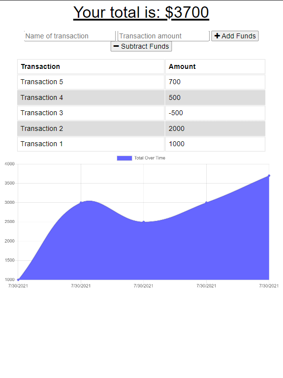
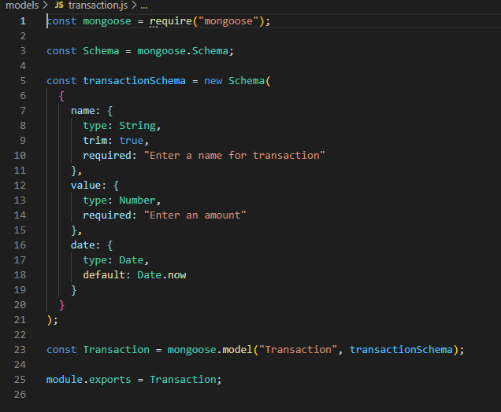
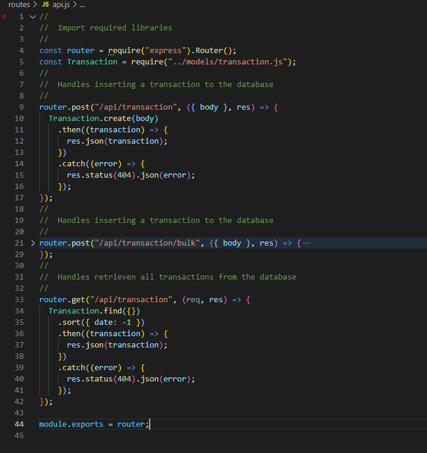
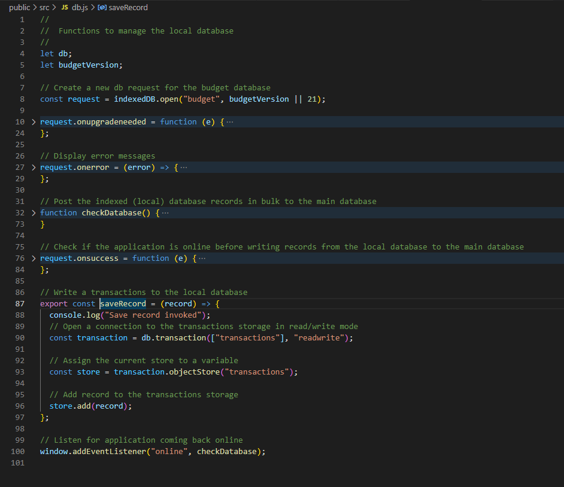
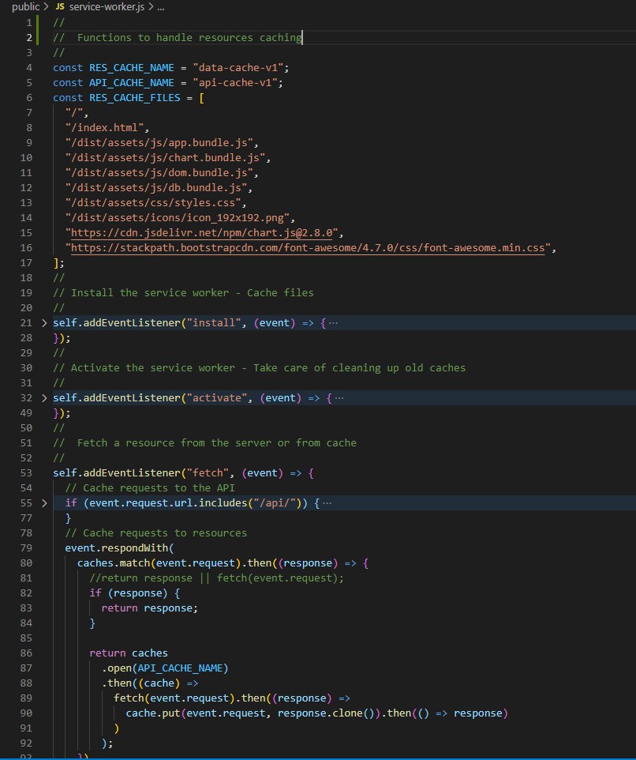

# Unit 19 PWA Homework: Online/Offline Budget Tracker

This is a **budget tracker** web application that uses **MongoDb** as the persistent storage, **Mongoose** as the object modelling, **ExpressJS** as the web framework, and **NodeJS** as the Javascript runtime environment. The application is described in the following user story, business context, and acceptance criteria:

## User Story

- AS AN avid traveller
  I WANT to be able to track my withdrawals and deposits with or without a data/internet connection
  SO THAT my account balance is accurate when I am traveling.

## Business Context

Giving users a fast and easy way to track their money is important, but allowing them to access that information anytime is even more important. Having offline functionality is paramount to an application's success.

## Acceptance Criteria

GIVEN a user is on Budget App without an internet connection
WHEN the user inputs a withdrawal or deposit
THEN that will be shown on the page, and added to their transaction history when their connection is back online.

The user will be able to add expenses and deposits to their budget with or without a connection. When entering transactions offline, they should populate the total when brought back online.

Offline Functionality:

- Enter deposits offline

- Enter expenses offline

When brought back online:

- Offline entries should be added to tracker.

## Implementation

- [Features](#features)
- [Installation](#installation)
- [Usage](#usage)
- [License](#license)

## Features

On the technical architecture, the application features the use of the MVC paradigm with **Database Schemas**, the logical structure of the database, defined with **Mongoose** and persisting in **MongoDb**; **HTML** to enable the input and rendering of the application data; **Express.Js** for route handling, and **Node.Js** for Javascript running.

The application uses a _Transaction_ model hosted on a **NoSQL** database, **MongoDb**. The model structure includes the following fields: _name_, of type String, representing the transaction description; _value_, of type Number, representing the transaction amount; and _date_, of type Date, defaulted to now, representing the transaction date.

Functionally, the application allows users to perform the following CRUD operations:

- Create a transaction (debit or credit)
- Create transactions in bulk (used when posting transactions after being in disconnected mode)
- Retrieve all transactions (in descending order date)

The application also allows users to view the transaction statistics by day using an area chart.



On the technical side, the application showcases the following notable features:

### Mongoose Schema Definition



### Express API



### Indexed Database

To enable entering deposits and expenses in disconnected mode:





## Installation

The application requires [Node.Js](https://nodejs.org/en/) Runtime Library, [Express.js](https://www.npmjs.com/package/express), and [Mongoose](https://www.npmjs.com/package/mongoose) libraries, along with a running _local_ instance of [MongoDb](https://www.mongodb.com/), or a _cloud_ instance of **MongoDb** known as [Atlas](https://www.mongodb.com/cloud/atlas).

A JSON file containing these dependencies is included with this project. To set up the development environment for the application, simply run the following command:

```bash
npm install
```

Using **Node.Js** console, run the following command to seed the database with sample data:

```bash
npm run seed
```

A video demonstrating how to seed a similar database from the command line is provided [here](https://drive.google.com/file/d/1cxB7I41wX6AWwSDz2RDOpIf9_2EbgBuZ/view).

Once the database is created and seeded with sample data, run the following command to start the application:

```bash
node server.js
```

## Usage

The application has been coded to perform CRUD operations against a live **MongoDb** database using the following HTTP methods for REST APIs: _GET_ and _POST_. If you want to run the application in your development environment, make sure to follow the [Installation](#installation) instructions above; otherwise, the application has been deployed to [Heroku](https://ku-cbc-budget-tracker.herokuapp.com/) through a **CI/CD** pipeline, which also connects to a live **MongoDb Atlas** database.

In addition, the application has been coded with a _mobile first_ approach in mind.

## License

This project is licensed under The MIT License. Refer to https://opensource.org/licenses/MIT for more information of what you can and cannot do with this project. See contact information below if you have questions, comments, or suggestions for the project.

## Contributing Guidelines

Want to contribute to this project? You may clone or fork the project in GitHub. Note the licesing information referred in this file.

## Contact Information

For questions, comments, or suggestions, please contact me by E-Mail:

japinell@yahoo.com

Check out my other **cool** projects in GitHub - https://github.com/japinell

## License

This application is licensed under the following license:

[](https://opensource.org/licenses/MIT)(https://opensource.org/licenses/MIT)
